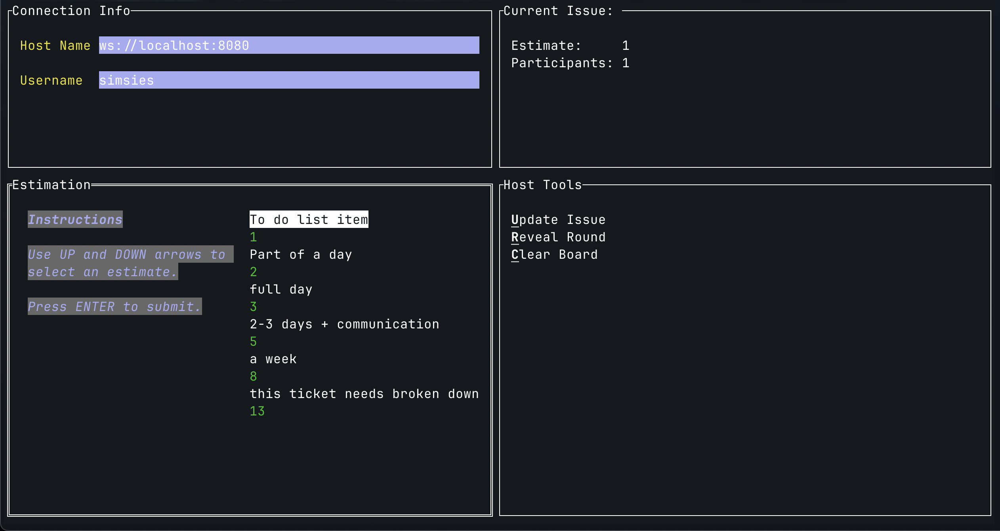

Planning

```
 _______    ______   __    __  ________  _______
/       \  /      \ /  |  /  |/        |/       \
$$$$$$$  |/$$$$$$  |$$ | /$$/ $$$$$$$$/ $$$$$$$  |
$$ |__$$ |$$ |  $$ |$$ |/$$/  $$ |__    $$ |__$$ |
$$    $$/ $$ |  $$ |$$  $$<   $$    |   $$    $$<
$$$$$$$/  $$ |  $$ |$$$$$  \  $$$$$/    $$$$$$$  |
$$ |      $$ \__$$ |$$ |$$  \ $$ |_____ $$ |  $$ |
$$ |      $$    $$/ $$ | $$  |$$       |$$ |  $$ |
$$/        $$$$$$/  $$/   $$/ $$$$$$$$/ $$/   $$/
```

_A TUI for estimating tickets with your team._

## Introduction



Free online planning poker tools pretty universally suck. `poker` aims to fix that through the elimination of unnecessary features.

- No UI
- No integrations
- No infrastructure

Just install one executable - it can run in either client or server mode. Share around the IP it's running at, have your team connect, and start estimating.

## Installation

Two options.

1. Have `go` installed? Simply run `go install github.com/jcpsimmons/poker@latest`
2. No go? Pop over to the [releases page](https://github.com/jcpsimmons/poker/releases) and grab the latest. There are builds for every major system and arch.

## Use

The CLI can run in client or server mode. Here is how I like to configure a session:

1. Install `ngrok`
2. Start forwarding port `8080` via `ngrok` e.g. `ngrok http http://localhost:8080`
3. Fire up `poker` in server mode - `poker s` (this will run on `8080` by default)
4. In another terminal window - connect to your instance as a client in host mode: `poker client --host simsies wss://ngrok-gibberish.ngrok-free.app` (be certain you're using `wss` if using `ngrok`)
5. Share the URL with your team - to connect as a non-host client: `poker client [USERNAME] wss://ngrok-gibberish.ngrok-free.app`

### Notes

This can also be run on a LAN - especially useful if your team is all on VPN together or on the same office network. Server protocol when running locally will default to `ws` instead of `wss`.

## Contributing

I welcome contributions - this is my first app written in Golang. There are currently no tests so that may be a good place to begin with contributions!
